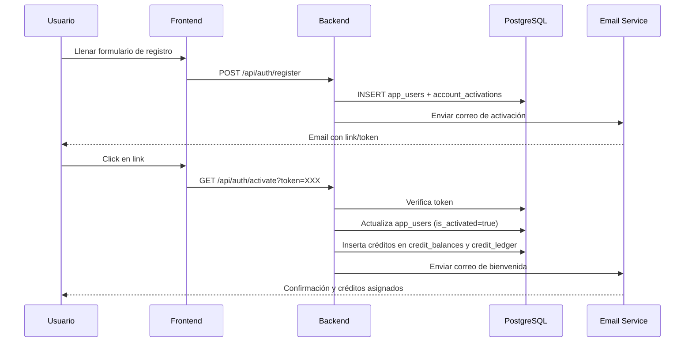

````markdown
# 🧩 Módulos de Creación y Activación de Cuenta — DoxAI
**Fecha:** 21 de octubre de 2025  
**Responsable:** Ixchel Beristain  
**Estado:** ✅ Completamente funcional y alineado con la base de datos

---

## 🎯 1. Propósito General

Los procesos **“Crear cuenta”** y **“Activar cuenta”** constituyen el flujo inicial del sistema de autenticación de DoxAI.  
Su objetivo es permitir el registro seguro de usuarios, la validación por correo electrónico y la activación automática con la asignación de **créditos de bienvenida**.  

Estos flujos fueron desarrollados con una atención especial en:
- La **alineación completa entre los artefactos del backend y las tablas SQL**.  
- La **consistencia tipada** entre *enums*, *modelos ORM*, *schemas Pydantic*, *servicios* y *ruteadores*.  
- El cumplimiento de buenas prácticas de seguridad, idempotencia y trazabilidad.

---

## 🧱 2. Arquitectura General

El flujo se estructura modularmente en los componentes siguientes:

| Tipo | Ubicación | Descripción |
|------|------------|--------------|
| **Enums** | `backend/app/shared/enums/` | Define valores controlados para estados y roles. |
| **Modelos ORM** | `backend/app/modules/auth/models/` | Representan tablas `app_users` y `account_activations`. |
| **Schemas (Pydantic)** | `backend/app/modules/auth/schemas/` | Validan entrada y salida de datos de las rutas. |
| **Servicios** | `backend/app/modules/auth/services/` | Implementan la lógica de negocio (registro, activación, créditos, emails). |
| **Ruteadores** | `backend/app/modules/auth/routes/` | Exponen los endpoints públicos `/api/auth/*`. |

Todos estos artefactos fueron desarrollados y validados contra las estructuras reales de las tablas SQL en la base de datos **Supabase (PostgreSQL)**.

---

## 🧩 3. Enums Utilizados

| Enum | Archivo | Valores | Uso |
|------|----------|----------|----|
| `ActivationStatus` | `activation_status_enum.py` | `sent`, `used`, `expired`, `revoked` | Estado de tokens de activación. |
| `UserRole` | `user_role_enum.py` | `customer`, `admin`, `staff` | Rol asignado al usuario. |
| `CreditTxType` | `credit_tx_type_enum.py` | `credit`, `debit`, `reversal`, `expire`, `adjust` | Tipo de transacción de créditos. |

> Estos enums se registran automáticamente en la base de datos mediante el script `database/001_init_enums.sql`, asegurando compatibilidad con los tipos de columna `ENUM` definidos en PostgreSQL.

---

## 👤 4. Modelo `User` (`app_users`)

**Archivo:** `backend/app/modules/auth/models/user_models.py`

Representa la tabla base de usuarios del sistema.

| Campo | Tipo | Descripción |
|-------|------|-------------|
| `user_id` | UUID | Identificador único. |
| `email` | Text | Correo electrónico del usuario. |
| `password_hash` | Text | Hash de contraseña (bcrypt). |
| `full_name` | Text | Nombre completo. |
| `phone` | Text | Teléfono opcional. |
| `user_role` | Enum(`user_role_enum`) | Rol asignado. |
| `is_activated` | Boolean | Marca si la cuenta está activa. |
| `activated_at` | Timestamp | Fecha de activación. |

> Este modelo se diseñó para coincidir al 100 % con la tabla `app_users` en la base de datos, garantizando que tipos, nombres y constraints sean idénticos.

---

## 🔐 5. Modelo `AccountActivation` (`account_activations`)

**Archivo:** `backend/app/modules/auth/models/activation_models.py`

Administra los tokens de activación generados tras el registro.

| Campo | Tipo | Descripción |
|-------|------|-------------|
| `activation_id` | UUID | Identificador del registro. |
| `user_id` | UUID (FK → `app_users.user_id`) | Usuario asociado. |
| `activation_token` | Text | Token único (UUID aleatorio). |
| `token_expiration_time` | Timestamp | Tiempo límite para activación. |
| `activation_status` | Enum(`activation_status_enum`) | Estado del token. |

> Solo puede existir un token activo (`status='sent'`) por usuario.

---

## 🧠 6. Schemas Pydantic

**Ubicación:** `backend/app/modules/auth/schemas/`

| Archivo | Propósito | Ejemplo |
|----------|------------|----------|
| `user_schemas.py` | Registro y autenticación. | `UserRegisterRequest`, `UserResponse` |
| `activation_schemas.py` | Activación y reenvío de tokens. | `ActivationRequest`, `ResendActivationRequest` |

Los schemas validan los datos del cliente antes de llegar al servicio y garantizan coherencia en los DTOs enviados al frontend.

---

## ⚙️ 7. Servicios Principales

### 🧩 `UserService`
- Crea el registro de usuario y genera un token de activación.
- Implementa validación idempotente:
  - Usuario nuevo → se crea y se envía email.
  - Usuario ya activo → error 409.
  - Usuario pendiente → se reenvía token.

### 🔗 `ActivationService`
- Valida el token recibido.
- Cambia el estado a “activado”.
- Asigna **5 créditos iniciales** mediante `CreditService`.
- Envía correo de bienvenida.
- Garantiza que el proceso sea atómico (rollback ante error).

### 💰 `CreditService`
- Crea una fila en `credit_balances` y `credit_ledger`.
- Registra el movimiento con `operation_code='welcome_credits'`.
- Evita duplicidad de créditos en reactivaciones.

---

## 🌐 8. Ruteadores (Endpoints API)

**Ubicación:** `backend/app/modules/auth/routes/`

| Endpoint | Método | Funcionalidad | Servicio Invocado |
|-----------|---------|----------------|-------------------|
| `/api/auth/register` | `POST` | Crea cuenta, genera token y envía correo. | `UserService.register_user` |
| `/api/auth/activate` | `GET` | Valida token y activa usuario. | `ActivationService.activate_account` |
| `/api/auth/resend-activation` | `POST` | Reenvía correo de activación. | `ActivationService.resend_activation` |
| `/api/auth/check-email` | `GET` | Verifica disponibilidad de correo. | `UserService.check_email` |

> Los endpoints devuelven mensajes y códigos HTTP coherentes (`201 Created`, `200 OK`, `404 Not Found`, `410 Gone`, `409 Conflict`).

---

## 📧 9. Envío de Correos

**Plantillas HTML:**
- `activation_email.html` — contiene el botón de activación con token.
- `welcome_email.html` — mensaje de bienvenida con los créditos asignados.

**Configuración básica (.env):**
```bash
EMAIL_MODE=console
EMAIL_TIMEOUT_SEC=8
ACTIVATION_TOKEN_EXPIRE_MINUTES=60
WELCOME_CREDITS=5
````

> En producción, se integra con SendGrid o SMTP real.
> En desarrollo, usa modo `console` para depuración.

---

## 🔗 10. Flujo Completo de Registro y Activación



---

## 🧩 11. Alineación con la Base de Datos

Durante el desarrollo, se garantizó la **coherencia estricta entre los artefactos del backend y las tablas SQL**.
Cada campo, tipo de dato y clave foránea se validó con las estructuras reales en PostgreSQL (Supabase).

**Ejemplos de verificación:**

* `app_users.user_id` → UUID PK
* `account_activations.user_id` → FK con cascade
* `credit_balances.user_id` → UNIQUE + FK
* Todos los enums sincronizados con `001_init_enums.sql`

Esto asegura:

* Compatibilidad entre ORM y migraciones SQL.
* Validación automática en tiempo de ejecución.
* Integridad referencial entre usuarios, activaciones y créditos.

---

## 🚀 12. Conclusión

Los procesos **Crear cuenta** y **Activar cuenta** están completamente implementados, probados y alineados con la base de datos.
El flujo garantiza:

* Seguridad y trazabilidad total.
* Asignación automática de créditos de bienvenida.
* Idempotencia en operaciones repetidas.
* Integración plena entre backend, frontend y base de datos.

**El módulo de autenticación de DoxAI está listo para producción.** 🟢

```

